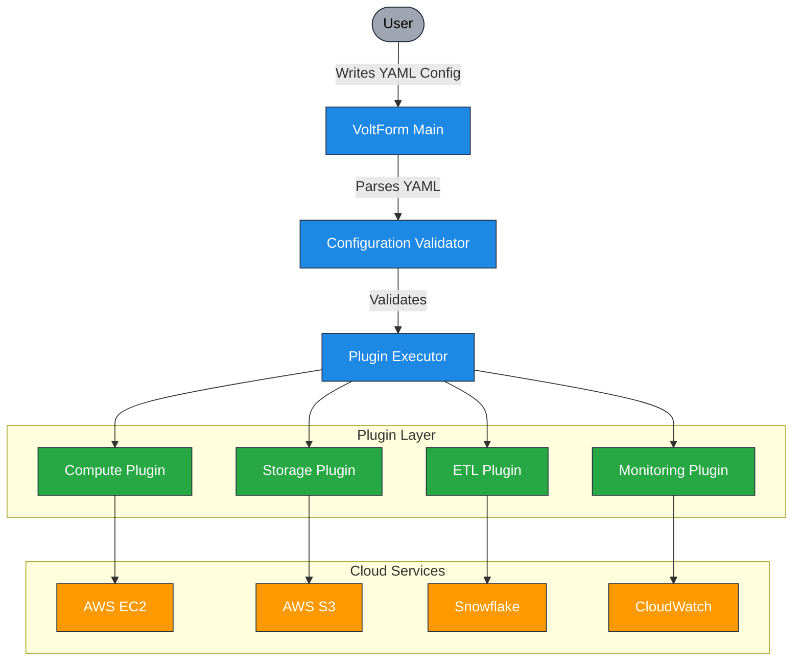

# VoltForm_Use_docs

## Using VoltForm

VoltForm is a tool designed to help you define and manage your ETL infrastructure and pipelines. This guide will walk you through the steps to use VoltForm effectively.

## Prerequisites

Before you start, ensure you have the following:
- Python installed on your system
- Pip package manager
- AWS account (if using AWS services)
- Snowflake account (if using Snowflake as a data warehouse)

## Installation

To install VoltForm, use pip:

```bash
pip install voltform
```

## Configuration

Create a YAML configuration file to define your infrastructure and ETL pipeline. Below is an example configuration file named `voltform_example.yaml`:

```yaml
infrastructure:
  name: "financial_data_etl"

  compute_cluster:
    type: "aws_ec2"
    cluster_name: "financial-etl-cluster"
    region: "us-east-1"
    instance_type: "m5.large"
    node_count: 3
    auto_scaling: true
    scaling_limits:
      min_nodes: 2
      max_nodes: 5

  storage:
    data_lake:
      name: "financial_data_lake"
      provider: "aws_s3"
      region: "us-east-1"
      bucket_name: "financial-data-etl-bucket"
      encryption: "AES256"
      versioning: true
      lifecycle_rules:
        - transition_to_glacier: 30  # Days before moving to Glacier
        - delete_after: 365  # Days before deletion

  etl_pipeline:
    name: "financial_etl_pipeline"
    source: "s3://financial-data-etl-bucket/raw"
    transformations:
      - type: "filter"
        condition: "transaction_amount > 1000"
      - type: "aggregate"
        field: "transaction_type"
        function: "sum"
      - type: "normalize"
        field: "currency"
        method: "USD_conversion"
    destination:
      type: "data_warehouse"
      provider: "snowflake"
      schema: "finance"
      table: "transactions_summary"
      credentials_secret: "snowflake_creds"

  monitoring:
    enabled: true
    logs:
      provider: "cloudwatch"
      retention: 7  # Days to retain logs
    alerts:
      - event: "ETL_FAILURE"
        action: "send_email"
        recipients:
          - "admin@company.com"
```



## Running VoltForm

To run VoltForm with your configuration file, use the following command:

```bash
voltform apply -f voltform_example.yaml
```

This command will set up the infrastructure and ETL pipeline as defined in your configuration file.

## Monitoring and Alerts

VoltForm supports monitoring and alerting. In the example configuration, CloudWatch is used for logging, and an email alert is set up for ETL failures. You can customize these settings as needed.

## Conclusion

VoltForm simplifies the process of defining and managing ETL infrastructure and pipelines. By following this guide, you can quickly set up and run your ETL processes with ease. For more advanced configurations and options, refer to the VoltForm documentation.